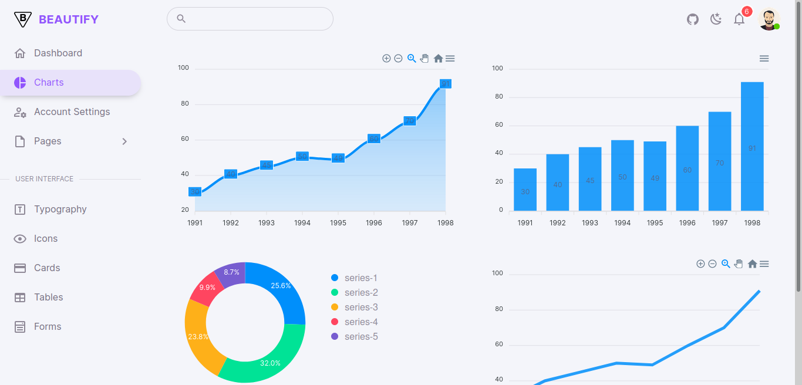
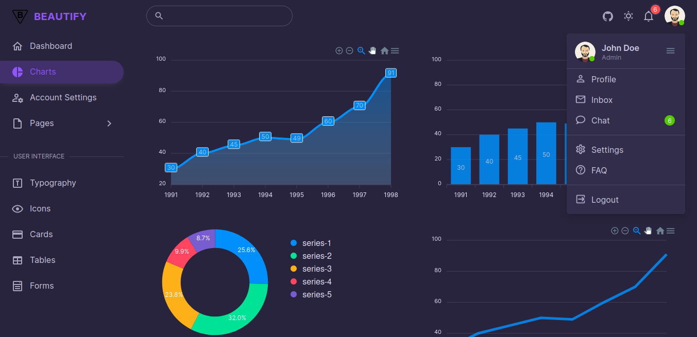

# Beautify

`Beautify` is a simple `Vuetify` Admin Dashboard. Also helps your apps will be completely responsive, ensuring they’ll look stunning and function flawlessly on desktops, tablets, and mobile devices

> we will use Vue.js when Vuetify 3 Titan released (May 2022).

<kbd></kbd>

<hr>

<kbd></kbd>

## Installation

> I recommend you to use yarn

1. Install all packages

   ```bash
   yarn

   # npm install [for npm]
   ```

2. Run development server

   ```bash
   yarn serve

   # npm run serve [for npm]
   ```

3. Generate build files for deployment

   ```bash
   yarn build

   # npm run build [for npm]
   ```

## What's Included

- Dashboard
- Charts
- Account Settings
- Pages
  - Login
  - Register
  - Error
- Other Example

  - Icons
  - Typography
  - Tables
  - Cards
  - Forms

## Changelog

[CHANGELOG](./CHANGELOG.md)

## License

[MIT License](./LICENSE)
